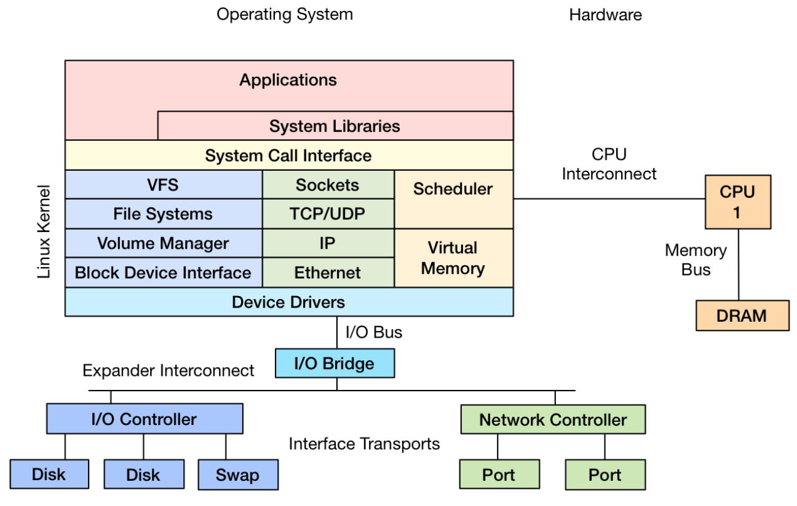

# Linux performance tools and programs
A small personal list of perf commands, tools, and related programs of the linux kernel. This list is heavily inspired by the one on [Linux Performance site by Brendan Gregg](http://www.brendangregg.com/linuxperf.html). Figure 1 summarizes the tools available to us. The tools can be categorized into perf during runtime (with active load) and during "rest" (with no active load).

<figure><figcaption><b>1- Linux performance tools are classified in observability, static performance, and tracing tools. From [1].</b></figcaption></figure>

## Observability
This category includes a set of tools that measure and observe the system during runtime. A good initial question is to go from Figure 2 and ask "How do you measure the behavior of the system represented here ?".

<figure><figcaption><b>2- Linux system summarized. From [4].</b></figcaption></figure>

### perf_events (AKA perf)
### eBPF and bcc
`NB.` If the installation of your `bcc-tools` package (e.g. Ubuntu) fails to show the tools, check if the installation directory is outside your `PATH`. On my machine, it put `bcc` in the `/usr/share` directory. If this is the case for you, either add `/usr/share/bcc/tools/` to your `PATH` or move the content to `/usr/local/bin`, for example.
### tiptop

## References
- [[1] Linux Performance site by Brendan Gregg](http://www.brendangregg.com/linuxperf.html)
- [[2] Linux Perf Wiki](https://perf.wiki.kernel.org/index.php/Main_Page)
- [[3] Adventures in /usr/bin and the likes by Alexander Blagoev](https://ablagoev.github.io/linux/adventures/commands/2017/02/19/adventures-in-usr-bin.html)
- [[4] Linux Systems Performance presentation at the PerconaLive 2016 by Brendan Gregg](https://www.slideshare.net/brendangregg/linux-systems-performance-2016)
- [[5] Erven Rohou. Tiptop: Hardware Performance Counters for the Masses. [Research Report] RR-7789, INRIA. 2011, pp.23. <hal-00639173>](https://hal.inria.fr/hal-00639173)
- [[6] Linux Performance counters](https://anton.ozlabs.org/blog/2009/09/04/using-performance-counters-for-linux/)
- [[7] Linux Enhanced Berkeley Packet Filter (eBPF) and its Compiler Collection (bcc)](http://www.brendangregg.com/ebpf.html)
- [[8] BCC installation](https://github.com/iovisor/bcc/blob/master/INSTALL.md)